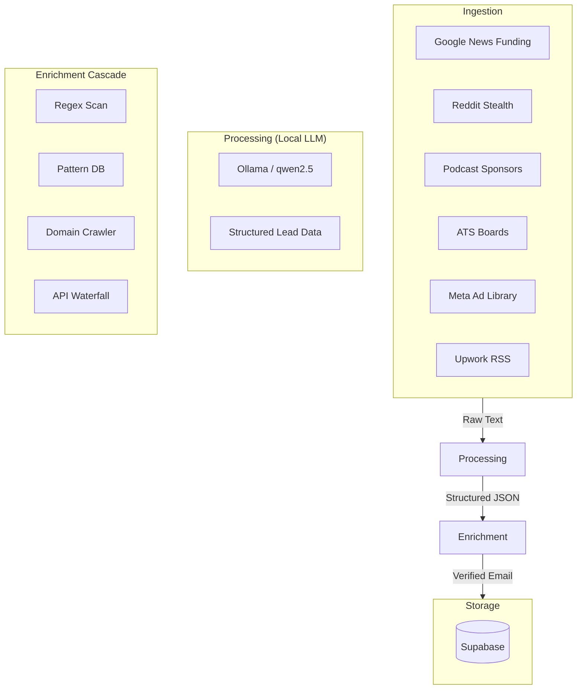

# Closr — Autonomous Creator Economy Lead Engine

Closr is a high-leverage lead generation engine designed for the creator economy. It automatically discovers brands with active marketing budgets, enriches them with verified decision-maker emails, and injects them into a daily lead pool for creator outreach.

**Creators open their app at 9am and see a fresh pool of warm, pre-pitched brand leads ready for cold email.**

---

## 🚀 Key Features

- **Multi-Source Ingestion**: Scrapes 9+ diverse sources including Meta Ads, Reddit, Podcast feeds, and ATS boards.
- **Local LLM Intelligence**: Uses Ollama (qwen2.5:7b) to synthesize raw data into structured intent signals and personalized pitches.
- **Privacy-First Enrichment**: Prioritizes local regex extraction and pattern database lookups before escalating to premium APIs.
- **Free-Tier Waterfall**: Intelligently manages credits across Hunter.io, Snov.io, and Prospeo to maintain a $0/month operating cost.
- **Supabase Integration**: Real-time daily pool management with automated cleanup of stale leads.
- **Stealth Mode**: Uses headless crawling and RSS feeds to minimize bot detection.

---

## 🏗 System Architecture



---

## 🛠 Ingestion Pipeline & Logic

### 1. Raw Data Extraction
The engine runs multiple concurrent scrapers to identify "intent signals" — events that indicate a brand has budget and a need for creators (e.g., a Series A funding round, a new podcast sponsorship, or a hiring spree for UGC creators).

### 2. LLM Synthesis (The "Brain")
Raw text from scrapers is passed to a local instance of **Ollama**. Unlike generic scrapers, Closr uses the LLM to:
- Identify the **actual brand** (ignoring the platform name).
- Determine the **intent tier** (High: Active Hiring, Medium: Recent Funding).
- Generate a **Contextual Pitch** based on the specific signal found.

### 3. Enrichment Cascade
To avoid expensive API costs, the enrichment phase follows a strict priority order:
1. **Regex**: Scans raw scraper text for emails accidentally included in the listing.
2. **Pattern DB**: Checks a local database for previously resolved brand patterns.
3. **Hybrid Crawler**: A headless browser visits the brand's website to look for "Contact" or "Press" pages.
4. **API Waterfall**: If all local methods fail, it uses a tiered credit system (Hunter -> Snov -> Prospeo).

---

## 🤖 Local LLM Setup (Ollama)

Closr uses local LLMs to ensure data privacy and zero operating costs for data extraction.

1. **Install Ollama**: Download from [ollama.com](https://ollama.com).
2. **Pull the Model**:
   ```bash
   ollama pull qwen2.5:7b
   ```
3. **Environment Config**:
   Ensure `OLLAMA_BASE_URL` (default: `http://localhost:11434`) is accessible.

*Note: For machines with <8GB VRAM, we recommend `qwen2.5:3b`, though JSON extraction reliability may decrease.*

---

## ⚙️ Setup & Deployment

### 1. Clone & Install
```bash
git clone https://github.com/yourusername/lead_generator_for_closr.git
cd lead_generator_for_closr
pip install -r requirements.txt
```

### 2. Configure Secrets
Rename `.env.example` to `.env` and fill in your credentials:
- **Supabase**: URL and Service Role Key (for DB injection).
- **Reddit**: Client ID/Secret (for PRAW scraping).
- **Enrichment**: At least one API key from Hunter, Snov, or Prospeo.

### 3. Database Migration
Run the SQL schema provided in `db/migrations/001_initial_schema.sql` in your Supabase SQL Editor.

### 4. Run
- **Single Pass**: `python main.py`
- **Scheduled**: `python scheduler.py` (Runs daily at 06:00 and 13:00 IST)

---

## 📊 Monthly Operating Cost: ~$0

| Component | Cost | Why? |
|-----------|------|------|
| Intelligence | $0 | Local LLM (Ollama) |
| Database | $0 | Supabase Free Tier |
| Scrapers | $0 | RSS + Headless Browsing |
| Enrichment | $0 | Aggregated Free Tiers (150+ emails/mo) |

---

## ⚖️ Safety & Ethics
- **Rate Limiting**: All scrapers include jittered delays and respect `robots.txt` where applicable.
- **Data Privacy**: No lead data is sent to external LLM providers (OpenAI/Claude).
- **Public Data**: Only publicly available information is scraped and processed.
